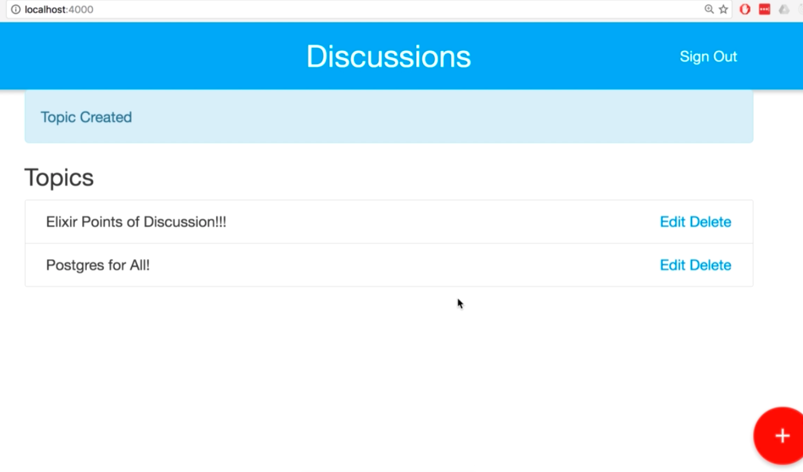
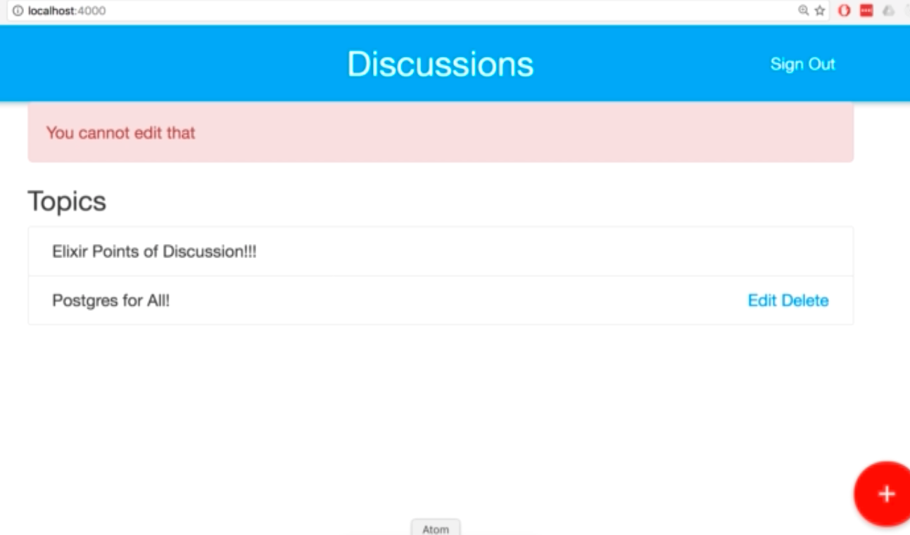

# Discuss

## About

Discuss is a an app for posting discussion topics and adding comments to those topics. A User that is not logged in can see the list of topics and visit topics to see the comments. Once logged in a User can create topics and add comments to topics. 

To start your Phoenix app:

  * Install dependencies with `mix deps.get`
  * Create and migrate your database with `mix ecto.create && mix ecto.migrate`
  * Install Node.js dependencies with `npm install`
  * Start Phoenix endpoint with `mix phoenix.server`

Now you can visit [`localhost:4000`](http://localhost:4000) from your browser.

Ready to run in production? Please [check our deployment guides](http://www.phoenixframework.org/docs/deployment).

## Learn more

  * Official website: http://www.phoenixframework.org/
  * Guides: http://phoenixframework.org/docs/overview
  * Docs: https://hexdocs.pm/phoenix
  * Mailing list: http://groups.google.com/group/phoenix-talk
  * Source: https://github.com/phoenixframework/phoenix
